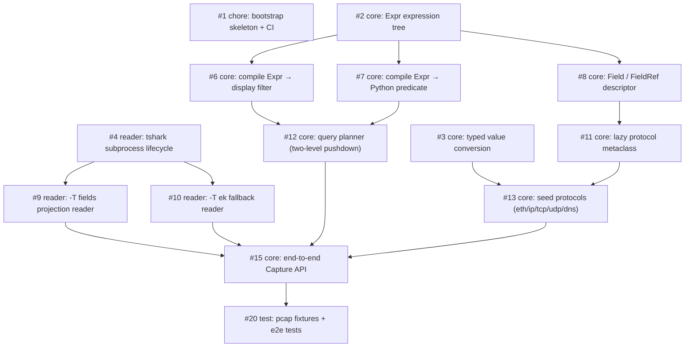

# Remora

A type-safe, IDE-friendly Python DSL for Wireshark/tshark capture analysis. Remora drives tshark subprocesses directly (no pyshark dependency): field access is statically typed, display filters are built from real expressions instead of bare strings, and predicates are pushed down to tshark where possible.

> A full README with quickstart and install instructions is tracked in [#24](https://github.com/iceboundrock/remora/issues/24).

## Roadmap

Each milestone has an EPIC issue defining its execution path and the PR ↔ issue plan:

| Milestone | EPIC | Goal |
|-----------|------|------|
| M1 可用内核 | [#40](https://github.com/iceboundrock/remora/issues/40) | end-to-end typed query over a pcap |
| M2 生成器与分发 | [#41](https://github.com/iceboundrock/remora/issues/41) | codegen + fingerprint + distribution |
| M3 打磨 | [#42](https://github.com/iceboundrock/remora/issues/42) | extended operators, real-tshark validation, docs |
| M4 数据工作区 | [#43](https://github.com/iceboundrock/remora/issues/43) | DuckDB materialized workspace |

### M1 可用内核 — dependency graph

Goal: run one end-to-end typed query against a pcap. Arrows point from a blocker to the issue it unblocks.

Milestones: [M1 可用内核](https://github.com/iceboundrock/remora/milestone/1) · [M2 生成器与分发](https://github.com/iceboundrock/remora/milestone/2) · [M3 打磨](https://github.com/iceboundrock/remora/milestone/3)
