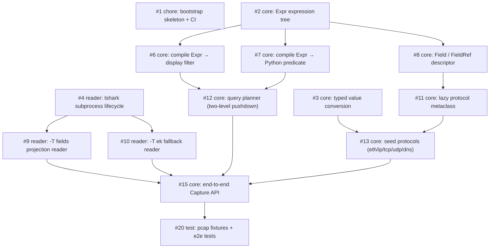

# Remora

A type-safe, IDE-friendly Python DSL for Wireshark/tshark capture analysis. Remora drives tshark subprocesses directly (no pyshark dependency): field access is statically typed, display filters are built from real expression trees instead of bare strings, and predicates are pushed down to tshark where possible.

```text
pyshark (stringly typed)                 Remora (typed DSL)
------------------------                 ------------------
pkt["ip"].src            # str? None?    pkt[IP].src        # IPv4Address | None
cap = pyshark.FileCapture(               cap = Capture("x.pcap").filter(
    "x.pcap",                                (IP.src == "10.0.0.1")
    display_filter="ip.src==10.0.0.1 "       & (TCP.port == 443)
                   "&& tcp.port==443")   )    # built, validated, pushed down
```

- **Typed fields.** `pkt[IP].src` is an `IPv4Address | None`, `pkt[TCP].port` is a `tuple[int, ...]` — generated `.pyi` stubs give your IDE completion for every field, and mypy knows the parsed type of each one.
- **No bare filter strings.** `IP.src == "10.0.0.1"` builds an expression tree; Remora compiles it to a Wireshark display filter and hands it to tshark (`-Y`) whenever it can, and falls back to an equivalent Python predicate when it can't.
- **No orphaned processes.** Iteration owns the tshark subprocess lifecycle; early `break`, exceptions, and GC all terminate it.

## Installation

Remora is pre-1.0 and is **not** on PyPI. Do not `pip install remora` — that name on PyPI belongs to an unrelated 2015 project ("a replacement for NRPE"). Install from git:

```sh
pip install "remora @ git+https://github.com/iceboundrock/remora"
```

The distribution name is not settled yet, so the eventual PyPI install command may differ. The repository is also private for now, so an anonymous clone of that URL 404s — use an authenticated remote (`git+ssh://git@github.com/iceboundrock/remora`) until it opens up.

Requirements:

- Python ≥ 3.10.
- A `tshark` binary on `PATH` (or point at one with `$TSHARK`, or `Capture(..., tshark="/path/to/tshark")`). tshark ships with [Wireshark](https://www.wireshark.org/download.html); on macOS `brew install --cask wireshark` or `brew install tshark`, on Debian/Ubuntu `apt install tshark`.

### Where protocol classes live

The core package ships typed modules for ~30 everyday protocols (`eth`, `ip`, `ipv6`, `tcp`, `udp`, `dns`, `http`, `http2`, `tls`, `quic`, `icmp`, `arp`, `dhcp`, `ntp`, `ssh`, `sip`, `rtp`, `sctp`, …). **They all live in `remora.proto`.** The top level re-exports only `Capture` and the five most common protocols (`ETH`, `IP`, `TCP`, `UDP`, `DNS`) as a convenience — everything else, including every extras protocol, is imported from `remora.proto`:

<!-- The ci: comment markers below opt a fence into tests/test_readme.py, which
     mypy-checks it and — in the exec and run modes — executes it in CI. A
     marker must sit on its own line immediately above its ```python fence. -->
<!-- ci:exec -->
```python
from remora import IP, Capture  # top-level convenience re-exports
from remora.proto import HTTP, QUIC, TLS  # everything else

query = (IP.src == "10.0.0.1") & (HTTP.request_method == "GET")
handshake = QUIC.long_packet_type.present() | TLS.handshake_type.present()
```

Core protocols are re-exported by name from `remora.proto`, so that import is fully typed.

### Protocol extras

Domain-specific protocol sets ship as separate distributions, selected with an extra:

| Extra | Adds to `remora.proto` | Distribution |
|---|---|---|
| `wireless` | `WLAN`, `RADIOTAP` | `remora-wireless` |
| `industrial` | `MODBUS`, `MBTCP`, `DNP3` | `remora-industrial` |
| `telecom` | `GTP`, `DIAMETER` | `remora-telecom` |
| `all` | everything above | all three |

The extras *distributions* are unpublished too, so `pip install "remora[wireless]"` cannot resolve — the extra points at a `remora-wireless` distribution that no index carries. Until they ship, install them from a checkout, alongside core. Each extra lives at `packages/<distribution>`, so name the ones you want:

```sh
git clone https://github.com/iceboundrock/remora
pip install ./remora ./remora/packages/remora-wireless
```

Listing all three is the equivalent of `remora[all]`:

```sh
pip install ./remora \
  ./remora/packages/remora-wireless \
  ./remora/packages/remora-industrial \
  ./remora/packages/remora-telecom
```

Working inside the repository, there is nothing to do: `uv sync` already installs all three extras as workspace members.

An extras distribution grafts its modules into `remora.proto` at install time, so no import path changes when you add one. Two import spellings, and the difference matters — the convenient one:

<!-- ci:exec -->
```python
from remora.proto import WLAN  # runtime convenience — a type checker sees `object`
```

and the typed one:

```python
from remora.proto.wlan import WLAN  # resolves the shipped .pyi stub
```

`remora.proto` reaches extras through a module-level `__getattr__`, which a type checker cannot follow, so prefer the submodule import in typed code. (Core protocols have no such caveat — they are re-exported by name.) Importing an extras protocol without its extra installed raises an `ImportError` naming the exact extra to install. Anything not shipped at all can be generated locally — see [Local generation](#local-generation-psdsl-gen).

## Quickstart

Point `Capture` at a pcap, filter with typed field comparisons, iterate:

<!-- ci:run -->
```python
from remora import IP, TCP, Capture

cap = Capture("capture.pcap")

for pkt in cap.filter((IP.src == "10.0.0.1") & (TCP.port == 443)):
    print(pkt[IP].src, pkt[TCP].dstport)
```

That's pcap → typed query → results:

- `Capture` is lazy and immutable — `.filter()` returns a new capture, iteration spawns tshark and yields matching packets.
- `IP.src == "10.0.0.1"` (class access) builds an expression; Remora compiles the whole conjunction to the display filter `(ip.src == 10.0.0.1) && (tcp.port == 443)` and pushes it down to tshark, so filtering happens at capture speed, not in Python.
- `pkt[IP].src` (instance access) returns a parsed `IPv4Address | None` — never a bare string, never an exception for an absent field.
- Opaque Python predicates work too — `cap.filter(lambda pkt: some_check(pkt))` — Remora runs what it can't push down as a residual filter in Python.

This snippet is executed by CI against a test pcap on every pull request and every push to `main` (see `tests/test_readme.py`), so it cannot rot.

## Two rules to learn before anything else

### Combine with `&` `|` `~`, never `and` `or` `not`

Python's `and`/`or`/`not` (and chained comparisons like `80 <= TCP.port <= 90`) need a boolean *now*; a Remora expression is a tree to be compiled *later*. Truth-testing an expression raises `TypeError` immediately — you can't silently get the wrong filter. Use the operator forms, and parenthesize comparisons (`&`/`|` bind tighter than `==`):

<!-- ci:exec -->
```python
from remora import IP, TCP

good = (IP.src == "10.0.0.1") & (TCP.port == 443)
alternative = (IP.src == "10.0.0.1") | (IP.dst == "10.0.0.1")
negated = ~(TCP.port == 443)
```

### Multi-value fields: `==` means "any occurrence", `!=` means "no occurrence"

Some fields occur several times per packet — `tcp.port` dissects as *both* the source and destination port, so its typed access is `pkt[TCP].port` → `tuple[int, ...]`. Comparisons follow Wireshark's any-occurrence semantics: `TCP.port == 443` matches if **any** occurrence equals 443.

Wireshark's own `!=` is a famous footgun: `tcp.port != 80` there means "any occurrence differs from 80", which still matches most packets *touching* port 80. Remora makes that pitfall unrepresentable — there is no `!=` node at all. `TCP.port != 80` compiles to `!(tcp.port == 80)`: *no* occurrence equals 80, i.e. genuinely "not port 80".

<!-- ci:exec -->
```python
from remora import TCP

not_port_80 = TCP.port != 80  # compiles to !(tcp.port == 80)
```

## Local generation (`psdsl gen`)

The committed protocol modules only cover what a stock tshark knows. If your tshark has plugins, Lua dissectors, or unusual protocols, generate typed modules locally against *your* binary:

```sh
uv run psdsl gen --protocols udp dns --out ./gen
```

`psdsl gen` runs the dump → parse → emit → fingerprint pipeline against the locally installed tshark (resolved from `--tshark`, then `$TSHARK`, then `PATH`, then Homebrew) with no version pin — the fingerprint header records whatever version generated the files. A missing binary or unknown protocol name exits nonzero with a one-line error.

`tshark -G fields` carries no multiplicity signal, so multiplicity is curated by hand: pass `--multi` with the field abbrevs that occur several times per packet, and they are declared multi-valued (`MultiField`); every other field is scalar and resolves to its first occurrence:

```sh
uv run psdsl gen --protocols dns ip --multi dns.qry.name ip.addr --out ./gen
```

The committed `remora.proto` modules curate multiplicity the same way, by hand.

**Importing the output.** The output directory is a plain directory of modules: each `.pyi` stub sits beside its `.py` module, so type checkers and IDEs resolve the stubs with no extra configuration. Generate into a directory inside your project (say `./gen`) and import it as a package — Python ≥3.3 namespace packages need no `__init__.py`:

```python
from gen.udp import UDP

query = UDP.srcport == 53
```

This works as long as the *parent* of the output directory is on the import path — true automatically when `gen/` sits in your project root and you run Python from there. At runtime, the generated modules import from `remora`, so `remora` must be installed in the environment that imports them. For mypy, the same layout just works; if you generate outside the project tree, add the parent directory to `mypy_path` (or `MYPYPATH`) and to `sys.path` at runtime.

For a worked end-to-end example (non-core protocol, `--multi` curation, imports), see the [codegen guide](docs/codegen.md).

## Contributing: regenerating the committed protocols

Protocol modules under `src/remora/proto/` (and the extras packages) are generated artifacts pinned to the tshark version in `codegen.toml`; CI re-checks byte equality on every pull request and every push to `main` (`uv run python -m remora.codegen check`). How to regenerate them, and what to do when the drift check fails, is covered in [docs/codegen.md](docs/codegen.md).

## Roadmap

Each milestone has an EPIC issue defining its execution path and the PR ↔ issue plan:

| Milestone | EPIC | Goal |
|-----------|------|------|
| M1 可用内核 | [#40](https://github.com/iceboundrock/remora/issues/40) | end-to-end typed query over a pcap |
| M2 生成器与分发 | [#41](https://github.com/iceboundrock/remora/issues/41) | codegen + fingerprint + distribution |
| M3 打磨 | [#42](https://github.com/iceboundrock/remora/issues/42) | extended operators, real-tshark validation, docs |
| M4 数据工作区 | [#43](https://github.com/iceboundrock/remora/issues/43) | DuckDB materialized workspace |

### M1 可用内核 — dependency graph

Goal: run one end-to-end typed query against a pcap. Arrows point from a blocker to the issue it unblocks.



Milestones: [M1 可用内核](https://github.com/iceboundrock/remora/milestone/1) · [M2 生成器与分发](https://github.com/iceboundrock/remora/milestone/2) · [M3 打磨](https://github.com/iceboundrock/remora/milestone/3)
